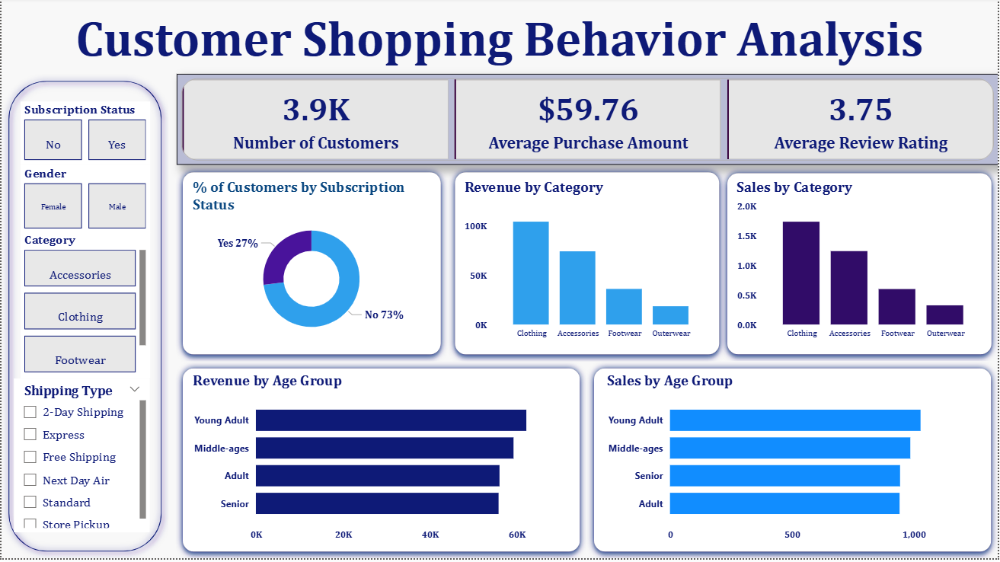

# 🛒 Customer Shopping Behavior Analysis

> **Uncovering consumer purchasing patterns, customer segmentation, and seasonal shopping trends using SQL, Python, and Power BI.**

---

## 📌 Table of Contents
- [Project Overview](#-project-overview)
- [Dataset Summary](#-dataset-summary)
- [Tools & Technologies](#-tools--technologies)
- [Project Structure](#-project-structure)
- [Key Insights & Analysis](#-key-insights--analysis)
- [Power BI Dashboard](#-power-bi-dashboard)
- [How to Run This Project](#-how-to-run-this-project)
- [Author & Contact](#-author--contact)

---

## 📖 Project Overview
The **Customer Shopping Behavior Analysis** project is a data-driven initiative designed to analyze consumer purchasing habits, segment shoppers into meaningful groups (such as loyal buyers, bargain hunters, premium shoppers, and occasional buyers), and highlight seasonal demand cycles. 

By running data cleaning, exploratory data analysis (EDA), and predictive modeling, this project provides actionable recommendations for marketing strategies, product positioning, customer retention, and inventory management.

---

## 📊 Dataset Summary
* **Dataset Name:** `customer_shopping_behavior.csv`
* **Source:** Customer transaction records
* **Key Attributes:** Customer ID, Age, Gender, Item Purchased, Category, Purchase Amount (USD), Location, Size, Color, Season, Review Rating, Subscription Status, Shipping Type, Discount Applied, Promo Code Used, Previous Purchases, Preferred Payment Method, and Frequency of Purchases.

---

## 🛠️ Tools & Technologies
* **Database & Querying:** SQL (`customer_shopping_behavior_analysis.sql`)
* **Data Processing & EDA:** Python, Pandas, NumPy (Jupyter Notebook)
* **Visualization & Dashboards:** Power BI (`customer_shopping_behavior_analysis.pbix`)
* **Documentation & Reporting:** PDF Report (`Customer Shopping Behavior Analysis.pdf`)

---

## 📂 Project Structure
```text
customer_shopping_behavior_analysis/
|
└── README.md
├── reports/
│   └── Customer Shopping Behavior Analysis.pdf   # Executive summary report
├── data/
│   └── customer_shopping_behavior.csv            # Raw dataset
├── notebooks/
│   └── Customer_Shopping_Behavior_Analysis.ipynb # Data cleaning & EDA notebook
├── sql/
│   └── customer_shopping_behavior_analysis.sql   # SQL queries & aggregations
├── dashboards/
    └── customer_shopping_behavior_analysis.pbix  # Power BI file                                  
```

## 💡 Key Insights & Analysis
* **Customer Segmentation:** Identified core spending groups based on age demographics, purchase frequency, and subscription status.

* **Discount Impact:** Evaluated how discounts and promo code usage affect overall order values and repeat purchase rates.

* **Seasonal Trends:** Highlighted top-performing product categories across different seasons to assist inventory stocking strategies.

---

## 📊 Power BI Dashboard
The included .pbix file provides an interactive visual dashboard featuring:
* Revenue and sales by product category.
* It shows Customer review ratings.
* Subscription status of customers in percentage.
  


---

## 🚀 How to Run This Project
### 1. Python Analysis (Jupyter Notebook)
* Open Command Prompt or PowerShell and clone the repository:
```DOS
git clone https://github.com/Shefali-L/customer_behaviour_analysis.git
cd customer_behaviour_analysis
```
* Install the required Python packages:
```DOS
pip install pandas numpy matplotlib seaborn jupyter
```
* Launch Jupyter Notebook:
```DOS
jupyter notebook Customer_Shopping_Behavior_Analysis.ipynb
```


### 2. SQL Analysis
* Import customer_shopping_behavior.csv into your preferred SQL database management system (e.g., PostgreSQL, MySQL, SQL Server).
* Execute the queries in customer_shopping_behavior_analysis.sql to reproduce data aggregations and segmentations.

### 3. Power BI Dashboard
* Download and install Power BI Desktop.
* Open customer_shopping_behavior_analysis.pbix to interact with the visualizations.

---

## 👤 Author
Author: Shefali L


